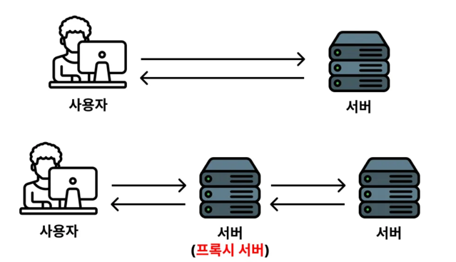
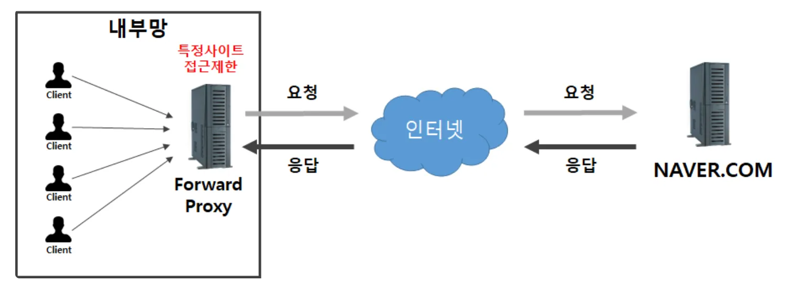
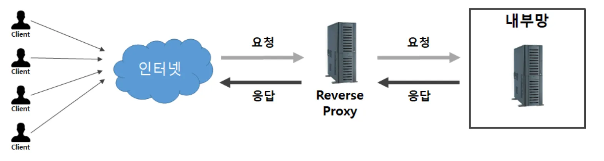

## Nginx 기본 개념

### Nginx를 왜 배우는 걸까?

Nginx는 다양한 기능을 가지고 있다.

- 정적 컨텐츠 제공
- SSL 처리
- 로드 밸런싱
- 장애 대응
- 캐싱
- 보안 처리(IP 차단, 요청 수 제한)

### Apache가 아닌 Nginx를 쓰는 이유?

간단하게 말하면, Nginx를 더 많이 사용하는 이유는 Apache에 비해 훨씬 많은 트래픽을 처리할 수 있는 구조를 가지고 있기 때문이다.  
https://www.youtube.com/watch?v=6FAwAXXj5N0&t=799s

---

## Nginx 다루기

### 아마존 리눅스에서 설치

```bash
# 패키지 리스트 최신화
sudo dnf update -y

# nginx 설치에 필요한 패키지 설치
sudo dnf install -y curl gnupg2 ca-certificates lsb-release

# nginx 공식 GPG 키 가져오기 및 등록
curl -fsSL https://nginx.org/keys/nginx_signing.key | sudo gpg --dearmor -o /etc/pki/rpm-gpg/nginx_signing_key.gpg

# nginx 저장소 추가
echo "[nginx-stable]
name=nginx stable repo
baseurl=http://nginx.org/packages/amazon/2023/\$basearch/
gpgcheck=1
enabled=1
gpgkey=file:///etc/pki/rpm-gpg/nginx_signing_key.gpg" | sudo tee /etc/yum.repos.d/nginx.repo

# 패키지 리스트 업데이트
sudo dnf update -y

# nginx 설치
sudo dnf install -y nginx

# nginx 서비스 실행 및 부팅 시 자동 시작 설정
sudo systemctl start nginx
sudo systemctl enable nginx
```

### 우분투에서 설치

```bash
# apt에서 설치 가능한 패키지 리스트(최신 패키지, 버전 등)를 최신화시킨다.
# apt는 리눅스에서 사용되는 소프트웨어 패키지를 설치 및 관리할 수 있게 도와주는 툴이다.
# npm 또는 gradle과 같은 패키지 관리 도구와 비슷하다고 생각하면 된다. 
$ sudo apt update

# nginx 설치에 필요한 라이브러리 설치
$ sudo apt install curl gnupg2 ca-certificates lsb-release ubuntu-keyring

# nginx 공식 패키지를 안전하게 설치하기 위한 보안 조치이다. 자세한 코드 의미는 몰라도 된다. 
# 다만, curl, gpg, tee, |, >, /dev/null, echo가 무슨 기능을 하는 명령어인지는 정리해두자. 
$ curl https://nginx.org/keys/nginx_signing.key | gpg --dearmor \
    | sudo tee /usr/share/keyrings/nginx-archive-keyring.gpg >/dev/null
$ gpg --dry-run --quiet --no-keyring --import --import-options import-show /usr/share/keyrings/nginx-archive-keyring.gpg
$ echo "deb [signed-by=/usr/share/keyrings/nginx-archive-keyring.gpg] \
http://nginx.org/packages/ubuntu `lsb_release -cs` nginx" \
    | sudo tee /etc/apt/sources.list.d/nginx.list

# nginx 설치
$ sudo apt update
$ sudo apt install nginx
```

### Nginx의 설정 파일 위치

```bash
/etc/nginx/nginx.conf
```

### Nginx 명령어

```bash
# nginx -t : nginx 설정 파일의 문법을 검사한다.
$ sudo nginx -t 

# nginx -s reload : nginx 설정 파일을 다시 읽어들인다.
$ sudo nginx -s reload

# 제대로 요청이 들어오고 있는 지 확인
$ sudo tail -f /var/log/nginx/access.log

# 에러 메시지 확인
$ sudo tail -f /var/log/nginx/error.log
```

### nginx로 정적 파일 서비스하기

```bash
sudo vi /etc/nginx/nginx.conf

# nginx.conf 파일에 아래 내용 추가
server {
    listen 80;
    server_name localhost;

    location / {
        root /usr/share/nginx/html;
        index index.html;
    }
}
# nginx 설정 파일 검사
sudo nginx -t

# nginx 설정 파일 다시 읽어들이기
sudo nginx -s reload
```

### Nginx로 React + vite 서비스하기

```bash
# React 프로젝트가 위치한 곳으로 이동한 뒤에
$ sudo npm i 
$ sudo npm run build

# nginx 설정 파일 수정
$ sudo vi /etc/nginx/nginx.conf
server {
    listen       80; 
    server_name  localhost;

    location / {
        root   /usr/share/nginx/nginx-frontend-react/dist;
        index  index.html;
    }

    error_page   500 502 503 504  /50x.html;
    
    location = /50x.html {
        root   /usr/share/nginx/html;
    }
}

$ sudo nginx -t
$ sudo nginx -s reload
```

### Nginx로 Next.js 프로젝트 서비스하기

```bash
server {
    listen       80; 
    server_name  localhost;

    location / {
        root   /usr/share/nginx/nginx-frontend-next/out;
        index  index.html;
    }

    error_page   500 502 503 504  /50x.html;
    
    location = /50x.html {
        root   /usr/share/nginx/html;
    }
}
```

### Nginx로 여러 도메인 서비스하기

```bash
server {
        listen 80;
        server_name wisehero.p-e.kr;

        location / {
                root /usr/share/nginx/nginx-frontend-react/dist;
                index index.html;
        }
}

server {
        listen 80;
        server_name admin.wisehero.p-e.kr;

        location / {
                root /usr/share/nginx/nginx-frontend-next/out;
                index index.html;
        }
}
```

---

## 프록시란?

프록시란 중계의 의미를 가진다. 그러면 프록시 서버는 중간 역할을 해주는 서버다.



### 포워드 프록시란?

**보내려고 하는 요청을 관리 또는 보안 처리를 위한 용도로 사용하는 서버를 포워드 프록시 서버라고 얘기를 한다.**  
포워드 프록시 서버의 대표적인 예시로 회사 방화벽이 있다. 회사 내부에 있는 컴퓨터로 ChatGPT에 접속하려는데 차단되는  
경우가 있다. 포워드 프록시 서버가 보내려고 하는 요청을 감시하면서 위험하다고 판단되는 사이트에 접속하지 못하게 차단하는 것이다.



### 리버스 프록시란?

들어오는 요청을 관리 또는 보안 처리를 하기 위한 용도로 사용하는 서버를 리버스 프록시 서버라고 한다.  
리버스 프록시 서버의 대표적인 예시가 HTTPS 처리, 요청 수 제한, 로드 밸런싱을 하는 용도로 사용하는 Nginx가 있다.  
리버스 프록시 서버가 들어오는 요청의 보안 처리를 하기 위해 HTTPS 처리를 한다. 그리고 들어오는 요청을 감시하다가  
일정 요청 수 이상을 보낼 때도 차단을 하게끔 설정할 수 있다. 또한 들어오는 요청을 여러 대의 서버로 분배해주는 역할인  
로드밸런싱 기능을 하게끔 셋팅할 수 있다.



---

## 로드밸런서

서비스를 운영하다보면 점점 많은 트래픽이 발생해 한 대의 서버로는 사양이 부족한 경우가 발생하게 된다.  
이걸 해결하기 위해 위와 같이 서버를 여러 대로 늘려서 서버를 운영한다. 하지만 사용자보고 여러 서버에 골고루 알아서  
요청을 보내라고 시킬 수는 없다. 사용자의 요청을 여러 대의 웹 애플리케이션 서버에 골고루 전달하기 위한 장치가 필요하다.  
그게 바로 로드 밸런서다.

## Nginx로 로드 밸런싱하기

```bash
# 로드 밸런싱 대상 서버들을 upstream이라는 그룹으로 묶음
# upstream 그룹의 이름은 backend라고 지정
upstream backend {
        server localhost:8080;
        server localhost:8081;
}

server {
        limit_req zone=mylimit;
        limit_req_status 429;
        server_name api.jscode.p-e.kr;

				# upstream 그룹에서 지정한 서버들로 요청이 분산됨
        location / {
                proxy_pass http://backend; # 여기가 중요!
        }

    listen 443 ssl; # managed by Certbot
    ssl_certificate /etc/letsencrypt/live/api.jscode.p-e.kr/fullchain.pem; # managed by Certbot
    ssl_certificate_key /etc/letsencrypt/live/api.jscode.p-e.kr/privkey.pem; # managed by Certbot
    include /etc/letsencrypt/options-ssl-nginx.conf; # managed by Certbot
    ssl_dhparam /etc/letsencrypt/ssl-dhparams.pem; # managed by Certbot

}

```