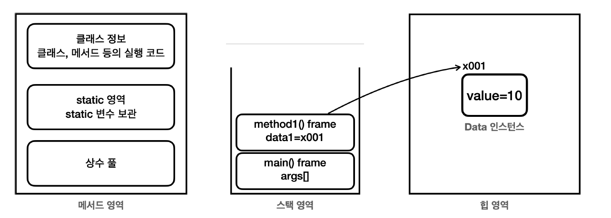
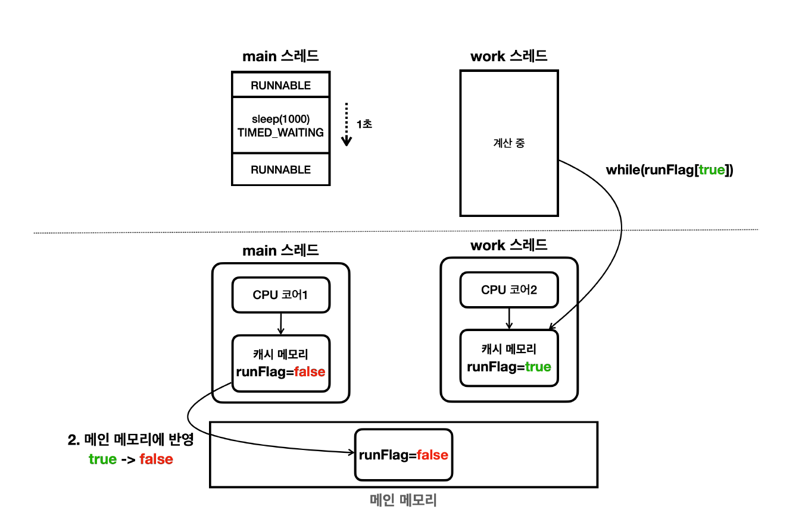
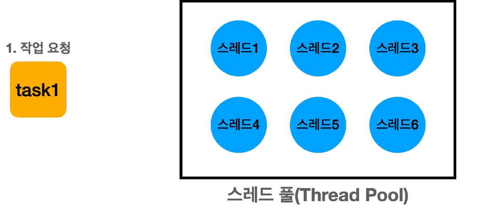
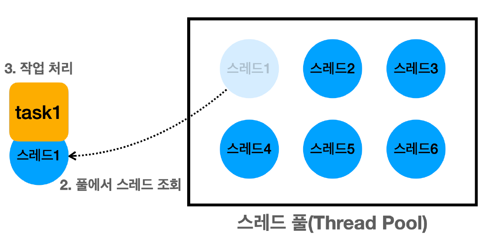
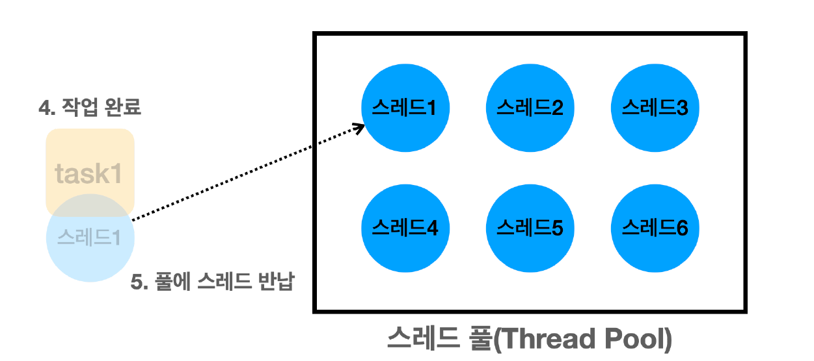

# 김영한 자바 고급 1편

---

## 섹션 1, 2 학습 내용 요약

### 멀티태스킹

- 멀티태스킹은 동시에 여러 작업을 수행하는 것을 의미한다.
- 소프트웨어적 관점에서 코어 1개에서 여러 프로그램을 동시에 실행하는 것을 의미한다.

### 멀티프로세싱

- 멀티 프로세싱은 2개 이상의 코어를 사용하여 여러 작업을 동시에 처리하는 것을 의미한다.
- 멀티 프로세싱을 수행한다는 것은 곧 멀티 태스킹을 수행한다는 것과 같다.(1개의 코어가 여러 개의 일을 수행하므로)

### 프로세스

- 프로세스는 실행(Running)중인 프로그램의 인스턴스다.
- 각 프로세스는 독립적인 메모리 공간을 갖고 있다. 따라서 서로 간섭하지 못한다.
- 하나의 프로세스가 강제로 종료되어도 다른 프로세스는 영향을 받지 않는다.
- 프로세스의 메모리는 코드(실행할 프로그램의 코드가 저장되는 부분), 데이터 섹션(변수), 힙, 스택으로 구성된다.

### 스레드

- 프로세스는 하나 이상의 스레드를 반드시 포함한다. 스레드는 프로세스 내에서 실행되는 작업의 단위다.
- 한 프로세스의 코드, 데이터, 힙 섹션은 모든 스레드가 공유한다. 스택 섹션은 각 스레드마다 독립적으로 할당된다.
- 따라서 스레드는 공유 영역이 있기 때문에 하나의 스레드에서 발생한 문제가 전파될 수 있다.

---

## 섹션 3, 4, 5 학습 요약

### 자바 메모리 구조

- 메서드 영역 : 클래스 멤버 변수, 메서드 정보, static 변수 런타임 상수 풀 등이 저장된다.
- 스택 영역 : 지역 변수, 중간 연산 결과, 메서드 호출 정보 등이 저장된다.
- 힙 영역 : 객체와 배열이 생성되는 영역, 가비지 컬렉션 대상이다.

### Java Thread

- Java는 `Thread`라는 클래스를 제공한다.
- Thread의 실행은 `Thread.start()` 메서드를 호출하여 실행한다. `Thread.run()` 메서드를 직접 호출하면 안된다.
    - 왜냐하면 `run()` 메서드를 직접 호출하면 새로운 스레드가 생성되지 않고 현재 스레드에서 실행되기 때문이다.

### Runnable

- 스레드를 사용할 때는 `Thread`를 상속받는 것보다 `Runnable` 인터페이스를 구현하는 것이 좋다.
- `Runnable` 인터페이스를 구현하면 다른 클래스를 상속받을 수 있기 때문이다. 스레드와 실행할 작업이 분리된다.
- 여러 스레드가 동일한 `Runnable` 인스턴스를 공유할 수 있다.

### 스레드의 생명 주기

- NEW : 스레드가 생성되었지만 `start()` 메서드가 호출되지 않은 상태
- RUNNABLE : 실행 중 또는 실행 가능한 상태. 모든 RUNNABLE 상태의 스레드들이 항상 동시에 실행 중인 것은 아니다.
- BLOCKED : 동기화 블록에 의해 일시정지된 상태
- WAITING : 다른 스레드의 작업을 기다리는 상태. `wait()`, `join()`, `sleep()` 메서드가 호출되면 이 상태가 된다.
- TIMED_WAITING : 일정 시간 동안 기다리는 상태
- TERMINATED : 실행을 마친 상태

### 스레드 주요 메서드

- `sleep(ms)` : 주어진 시간(ms) 동안 스레드를 일시정지시킨다.
- `join(ms)` : 주어진 시간(ms) 동안 스레드가 종료될 때까지 기다린다.
- `interrupt()` : 스레드를 강제로 종료시킨다.
- `yield()` : 다른 스레드에게 실행을 양보한다.

---

## 섹션 6 학습 요약

### 메모리 가시성

- 각 스레드는 각각의 CPU 코어에서 실행된다. 물론 CPU 코어가 1개이면 번갈아서 실행된다.
- 그리고 스레드는 메인 메모리에 접근해서 데이터를 읽고 쓴다.
- 하지만 실제로는 성능상 이점을 누리기 위해 캐시 메모리를 사용한다.
- 캐시 메모리는 CPU 코어마다 존재한다. 물론 여러 코어가 공유하는 캐시 메모리도 있다.
- 따라서 스레드가 쓴 데이터가 캐시 메모리에만 저장되어 있으면 다른 스레드는 그 데이터를 읽을 수 없다.
- 캐시 메모리에 저장되었다고해서 메인 메모리에 곧바로 반영되지 않는다. 이것을 메모리 가시성 문제라고 한다.
  

### volatile 키워드

- `volatile` 키워드를 사용하면 메모리 가시성 문제를 해결할 수 있다.
- `volatile` 키워드를 사용하면 변수를 읽을 때마다 메인 메모리에서 읽어온다.
- 따라서 다른 스레드가 쓴 데이터를 즉시 읽을 수 있다.
- 하지만 캐시 메모리에 접근하지 않고 메인 메모리에 접근하기 때문에 성능상 저하가 발생한다.

### 캐시 메모리가 메인 메모리에 반영되고 메인 메모리가 캐시 메모리에 반영되는 시점?

- 알 수 없다. 환경에 따라 다 다를 수 있다.
- `Thread.sleep()`이 호출되었을 때 컨텍스트 스위칭이 되면서 주로 갱신되지만 보장할 수 없다.
- 반드시 `volatile` 키워드를 사용해야 한다.

### 자바 메모리 모델

- JMM(Java Memory Model)은 자바 프로그램이 실행되는 동안 메모리를 어떻게 사용하는지 정의한다.
- 자바 메모리 모델의 happens-before 관계에서는 A 작업이 B보다 먼저 수행될 경우 B 작업은 A 작업의 변경사항을 볼 수 있다.
- `volatile` 키워드를 사용하면 happens-before 관계를 만족한다.
- 이외에도 다양한 스레드 동기화 기법(syncronized, ReentrantLock, Semaphore, CountDownLatch 등)가 있다.

---

## 섹션 7, 8 학습 요약

### 공유 자원

- 같은 자원에 여러 스레드가 동시에 접근할 때 발생하는 동시성 문제를 주의해야 한다.
- 이때 여러 스레드가 접근하는 같은 자원을 공유 자원이라고 한다.

### 임계 영역

- 여러 스레드가 동시에 접근하면 데이터 불일치나 예상치 못한 동작이 발생할 수 있는 코드 조각을 의미한다.
- 출금의 예시로 들면 출금은 우선 잔액을 확인하고 지정한 액수만큼 차감하는데, 차감하는 부분이 임계 영역이다.
- 임계 영역을 안전하게 보호하는 방법의 대표적인 방법은 `synchronized` 키워드를 사용하는 것이다.

### synchronized

- 모든 객체(인스턴스)는 자신만의 lock을 가지고 있다. 이 lock을 모니터 락이라고 한다.
- `synchronized`는 한 번에 하나의 스레드만 실행하는 임계 영역을 만들 수 있다.
- 하지만 한 번에 하나의 스레드만 실행할 수 있다는 것은 장점이자 단점이다.
- 또한 무한 대기에 빠질 수 있으며, **락을 획득하는 순서를 보장하지 않는다. 따라서 데드락에 빠질 수 있다.**
- 따라서 꼭 필요한 부분에서만 사용하도록 하자

### LockSupport

- `LockSupport`는 스레드를 WAITING 상태로 변경한다. `park()` 메서드를 사용하면 된다.
- 이외에도 `parkNanos(ms)` 메서드가 있다.

### BLOCKED vs WAITING

- `BLOCKED`는 동기화 블록에 의해 일시정지된 상태이다. `BLOCKED`상태는 인터럽트가 걸려도 대기 상태를 빠져나오지 못한다.
- `WAITING`은 다른 스레드의 작업을 기다리는 상태이다. 반면 `WAITING` 상태는 인터럽트가 걸리면 대기 상태를 빠져나올 수 있다.

### LockSupport의 한계

- 너무 저수준이다. 따라서 더 높은 수준의 동기화 기법이 필요한데, 이는 ReentrantLock이다.

### ReentrantLock

- JDK 1.5부터 제공되는 동기화 기법이다. synchronized의 무한 대기와 공정성 문제를 해결할 수 있다.
- `lock()` 메서드로 락을 획득하고 풀릴 때까지 대기한다. 인터럽트에 응답하지 않는다.
- `lockInterruptibly()` 메서드로 락을 획득하고 인터럽트에 응답한다. 락을 획득하지 못한 경우 대기하며 인터럽트가 걸리면 락을 풀고 예외를 던진다.
- `tryLock()` 메서드로 락을 획득하고 `true` 반환한다. 락을 획득하지 못한 경우 `false`를 반환한다.
- `unlock()` 메서드로 락을 해제한다. 락을 갖고 있는 스레드가 호출해야한다.

### 비공정 모드와 공정 모드

- **비공정 모드**는 `ReentrantLock`의 기본 모드이다. 락을 먼저 요청한 스레드가 락을 먼저 획득한다는 보장이 없다.
- 대기 중인 스레드 중 아무나 락을 획득할 수 있다. 이는 특정 스레드가 락을 빨리 획득할 수도, 장기간 획득하지 못할 수도 있음을 의미한다.
- 즉 기아 현상이 발생할 수 있다.
- 공정 모드는 락을 요청한 순서대로 스레드가 락을 획득할 수 있게 한다.
- 기아 현상을 방지할 수 있으나 락을 획득하는 속도가 느려질 수 있다.

---

## 섹션 9, 10 학습 요약

### 생산자 소비자 개념

- 생산자 : 데이터를 생성하는 역할
- 소비자 : 생성된 데이터를 사용하는 역할
- 버퍼 : 생산자가 생성한 데이터를 일시적으로 저장하는 공간

### 생산자 소비자 문제와 한정된 버퍼 문제

- 생산자 스레드와 소비자 스레드가 특정 자원을 함께 생산하고 소비하면서 발생하는 문제
- 한정된 버퍼 문제는 중간의 버퍼의 크기가 한정되어 있기 때문에 발생하는 문제
- 생산자가 버퍼에 데이터를 넣고 싶은데 버퍼가 꽉찼다면? 공간이 생길 때까지 기다리자!
- 소비자가 버퍼에서 데이터를 꺼내고 싶은데 데이터가 없다면? 채워질 때까지 기다리자!

### `wait`, `notify`

- `Object.wait()`
    - 현재 스레드가 가진 락을 반납하고 대기한다.
    - 현재 스레드를 대기 상태로 전환한다. 이 메서드는 현재 스레드가 `syncronized` 블록이나 메서에서 락을 소유하고 있을 때만 호출할 수 있다.
    - 이렇게 대기 상태로 전환된 스레드는 다른 스레드가 `notify()` 또는 `notifyAll()`을 호출할 때까지 대기 상태를 유지한다.
- `Object.notify()`
    - 대기 중인 스레드 중 하나를 깨운다.
    - 이 메서드는 synchronized 블록이나 메서드에서 호출해야 한다. 대기 중인 스레드가 여러 개라면 어떤 스레드가 깨어날지는 알 수 없다.
- `Object.notifyAll()`
    - 대기 중인 모든 스레드를 깨운다.
    - 이 메서드는 synchronized 블록이나 메서드에서 호출해야 한다.

### `wait`, `notify`의 한계

- 생산자가 생산자를, 소비자가 소비자를 깨울 수 있는 비효율이 발생한다.
- `notify()`를 실행했을 때 어떤 스레드가 깨어날 지 알 수 없기 때문에 스레드 기아 문제가 발생한다.
- 스레드 기아 문제를 해결하기 위해서는 `notifyAll()`을 사용하는 편이 나을 수도 있다.
- 하지만 비효율을 막지는 못한다.

### 한계를 극복하는 방법은?

- 생산자는 소비자를 깨우고, 소비자는 생산자를 깨우면 된다. 결국 대기 집합을 생산자 소비자로 각각 나누어야 한다.
- 이를 위해 `Condition`을 사용한다.

### `Condition`

- `Condition은` `ReentrantLock을` 사용하는 스레드가 대기하는 스레드 공간이다.
- `lock.newCondition()`으로 `Condition을` 생성한다. `condition.await()`으로 대기하고, `condition.signal()`로 깨운다.

### 스레드의 대기

- `syncronized` 대기
    - `BLOCKED` 상태로 대기한다.
    - `synchronized`를 시작할 때 락이 없으면 대기
    - 다른 스레드가 `synchronized` 블록을 빠져나가면 대기 중인 스레드 중 하나가 락을 획득한다.
    - 이 경우 스레드 대기 집합에서 대기하는 것이 아닌, 락 대기 집합에서 대기한다.
- `wait()` 대기
    - `WAITING` 상태로 대기한다.
    - `wait()`를 호출 했을 때 스레드 대기 집합에서 대기
    - 다른 스레드가 `notify()`를 호출했을 때 대기 집합에서 빠져나간다.
- 자바의 모든 객체 인스턴스는 멀티 스레드와 임계 영역을 다루기 위해 내부에 3가지 기본 요소를 가진다.
    - 모니터 락
    - 락 대기 집합(모니터 락 대기 집합)
    - 스레드 대기 집합
- 락 대기 집합과 스레드 대기 집합을 모두 빠져나와야 임계 영역을 수행할 수 있다.
- 저 3가지는 아래와 같이 서로 맞물려 있다.
    - `synchronized`를 사용한 임계 영역에 들어가려면 모니터 락이 필요하다.
    - 모니터 락이 없으면 락 대기 집합에 들어가서 `BLOCKED` 상태로 락을 기다린다.
    - 모니터 락을 반납하면 락 대기 집합에 있는 스레드 중 하나가 락을 획득하고 `RUNNABLE` 상태로 변경된다.
    - `wait()`을 호출해서 스레드 대기 집합에 들어가기 위해서는 모니터 락이 필요하다.
    - 스레드 대기 집합에 들어가면 모니터 락을 반납한다.
    - 스레드가 `notify()`를 호출하면 스레드 대기 집합에 있는 스레드 중 하나가 스레드 대기 집합을 빠져나온다.
        - 모니터 락을 획득하면 임계 영역을 수행한다.
        - 모니터 락을 획득하지 못하면 락 대기 집합에 들어가서 BLOCKED 상태로 락을 기다린다.
- 이는 `ReentrantLock과` `Condition`을 사용할 때도 동일하다.

---

## CAS(Compare And Swap)와 원자적 연산

### 원자적 연산

- 원자적 연산의 의미는 해당 연산이 더 이상 나눌 수 없는 단위로 수행된다는 것을 의미.
- 쉽게 이야기해서 멀티스레드 상황에서 다른 스레드의 간섭 없이 안전하게 처리되는 연산이라는 뜻이다.
- `i = 1`은 원자적 연산이지만, `i = i + 1`은 원자적 연산이 아니다.

### 락 기반 방식의 문제점

- `syncronized`, `Lock(RentrantLock)`은 락을 획득하고 반납하는 과정에서 성능 저하가 발생한다.
    - 락이 있는지 확인
    - 락을 획득하고 임계 영역에 진입
    - 작업 수행
    - 락 반납
- 이런 문제를 해결하기 위해 락을 걸지 않고 원자적인 연산을 수행할 수 있는 방법이 CAS(Compare And Swap)이다.
- CAS 연산이 완전히 락을 대체하는 것은 아니고 작은 단위의 일부 영역에 적용할 수 있다.
- 기본은 락을 사용하되 특별한 경우에 CAS를 적용할 수 있다고 생각하면 된다.

### CAS 연산

- 메모리 위치의 값을 비교하고, 그 값이 예상한 값과 같을 경우 새로운 값으로 교체하는 방식으로 동작한다.
    - 특정 메모리 주소에 있는 값을 읽어온다.
    - 그 값이 예상한 값과 동일한지 비교한다.
    - 동일하다면, 새로운 값을 해당 메모리 주소에 저장한다.
    - 이 과정이 완료되면, 연산의 성공 여부를 반환한다.
- 이 과정은 원자적이지 않지만 CPU 하드웨어 차원에서 특별하게 하나의 원자적인 연산으로 묶어서 제공한다.
- CAS를 활용하는 연산은 다른 스레드가 먼저 값을 변경해서 문제가 되는 경우, 다시 시도한다.

### CAS와 Lock 방식의 비교

- Lock
    - 비관적 접근법이다. 데이터에 접근하기 전에 항상 락을 획득한다.
    - 락을 획득한 이상, 다른 스레드의 접근은 차단한다.
    - 다른 스레드가 방해할 것이라고 가정해서 비관적 접근법이라고 한다.
- CAS
    - 낙관적 접근법
    - 락을 사용하지 않고 데이터에 바로 접근한다. 충돌이 발생하면 그때 재시도한다.
    - 대부분의 경우 충돌이 없을 것이라고 가정해서 낙관적 접근법이라고 한다.
- 사실은 CAS를 사용한다고해도 그렇게 충돌이 많이 발생하지 않는다. CPU는 엄청나게 빠르기 때문이다.

### 스핀 락

- 스핀 락은 스레드가 락이 해제되기를 기다리면서 반복문을 통해 계속 확인한다.
- CPU 자원을 계속 사용하면서 바쁘게 대기한다고 해서 바쁜 대기라고 한다.
- 스핀 락 방식은 아주 짧은 CPU 연산을 수행할 때 사용해야 효율적이다. 잘못 사용하면 CPU 자원을 낭비한다.

### 정리

- CAS는 낙관적 동기화다. 락을 걸지 않는 것은 충돌이 자주 발생하지 않을 것이라고 가정한다.
- CAS는 락을 걸지 않기 때문에 락을 기다리고 얻는 시간이 걸리지 않는다. 블로킹이 되지 않으며 병렬 처리에 효율적이다.
- 다만 충돌이 빈번한 경우엔 CPU 자원을 많이 소모하고, 성능 저하가 발생할 수 있다.
- 동기화 락은 충돌을 관리하며 안정성과 일관성을 보장한다. 다만 락 획득을 기다리고 컨텍스트 스위칭 오버헤드가 발생한다.
- 따라서 일반적으로는 동기화 락을 사용하고 아주 특별한 경우에 한정해서 CAS를 사용한다.

## 동시성 컬렉션

### 동시성 컬렉션이 필요한 이유

- `ArrayList`는 스레드 세이프할까?
- 대부분의 컬렉션 프레임워크가 제공하는 연산은 원자적인 연산이 아니다.
- 예를 들어 `List`에 요소를 추가하는 연산도 원자적인 연산이 아니다. 값을 넣고 사이즈를 늘려야 한다.
- 하지만 그렇다고 해서 컬렉션에 있는 모든 메서드에 `synchronized`를 걸면? 성능이 떨어진다.
- 따라서 기존 코드를 그대로 사용하면서 필요할때만 `synchronized`를 걸 수 있는 방법이 필요하다.

### 동시성 컬렉션 프록시 도입

- 프록시는 우리말로 대신 처리해주는 자라는 뜻이다.
- 의존성 주입을 사용해서 필드에 컬렉션을 선언하고 메서드는 `synchronized로` 감싼 채 원본 객체의 메서드를 호출하면 된다.
- 자바에서는 `Collections.synchronizedList()` 메서드를 사용하면 된다.

### synchronized 프록시 방식의 단점

- 동기화 오버헤드가 발생한다.
- 전체 컬렉션에 대해 동기화가 이루어지기 때문에 잠금 범위가 넓어진다. 이는 잠금 경합을 증가시키고 병렬 처리 효율성을 저하시킨다.
- 정교한 동기화가 불가능하다. 컬렉션 전체에 대한 동기화가 이루어지기 때문에 특정 부분이나 메서드에 대해 선택적으로 동기화를 적용하는 것은 어렵다.
- 따라서 이를 극복하기 위해서 `java.util.concurrent` 패키지에 동기화 컬렉션이 제공된다.

### 자바 동시성 컬렉션

- JDK 1.5부터 `java.util.concurrent` 패키지에 동시성 컬렉션이 추가되었다.
- 이 컬렉션들은 더 정교한 잠금 메커니즘을 사용하여 동시 접근을 효율적으로 처리한다.

### 동시성 컬렉션의 종류

- `CopyOnWriteArrayList` : 읽기 연산이 많고 쓰기 연산이 적은 상황에 사용한다.
- `ConcurrentHashMap` : `HashTable`의 대체제로 사용한다. `HashTable`은 모든 메서드에 `synchronized`가 걸려있어서 성능이 떨어진다.
- `CopyOnWriteArraySet` : `CopyOnWriteArrayList`의 `Set` 버전이다.
- `ConcurrentLinkedQueue` : non-blocking 큐이다.
- `ConcurrentLinkedDeque` : non-blocking 큐이다.

## 스레드 풀과 Executor 프레임워크

### 스레드를 직접 생성해서 사용하면 발생하는 문제점

- 스레드 생성 시간으로 인한 성능 문제
    1. 각 스레드는 자신만의 호출 스택을 가지고 있어야 한다. 이 호출 스택은 스레드가 실행되는 동안 사용하는 메모리 공간이다. 따라서 스레드를 생성할 때는 이 호출 스택을 위한 메모리를 할당해야 한다.
    2. 스레드를 생성하는 작업은 운영체제 커널 수준에서 이루어지며, 시스템 콜을 통해 처리되는데 이 과정에서 리소스를 소모한다.
    3. 새로운 스레드가 생성되면 운영체제의 스케줄러는 이 스레드를 관리하고 실행 순서를 조정해야 하는데 이 과정에서 오버헤드가 발생한다.
- 스레드 관리 문제
    1. 스레드는 무한하게 만들 수 없다. 최소, 최대 스레드 수를 제한해야 한다.
    2. 스레드가 남은 작업을 모두 수행한 다음에 프로그램을 종료한다거나 급하게 종료해야해서 인터럽트를 주고 싶은 경우 이 스레드들은 어디선가 관리되어야 한다.
- `Runnable` 인터페이스의 불편함
    - `Runnable` 인터페이스는 반환 값이 없다.
    - `run()` 메서드는 체크 예외를 던질 수 없다. 처리를 모두 `run()` 메서드 내부에서 해야 한다.

### 스레드 풀

- 스레드를 직접 생성해서 사용하면 발생하는 문제점들을 해결할 수 있는 방법이 스레드 풀이다.
- 스레드를 애플리케이션이 시작되는 시점에 스레드들을 미리 만들어두고 관리하며, 재사용이 가능하게 하여 성능을 향상시킨다.

### Executor 프레임워크

- 스레드 풀, 스레드 관리, Runnable의 문제점은 물론이고, 생산자 소비자 문제까지 한방에 해결해주는 도구이다.
- 지금까지 배운 멀티 스레드 기술의 총 집합이 여기에 들어있다.
- 실무에서는 직접 스레들르 하나하나 생성해서 사용하는 일이 드물다. 대신에 이 프레임워크를 주로 사용하게 된다.

