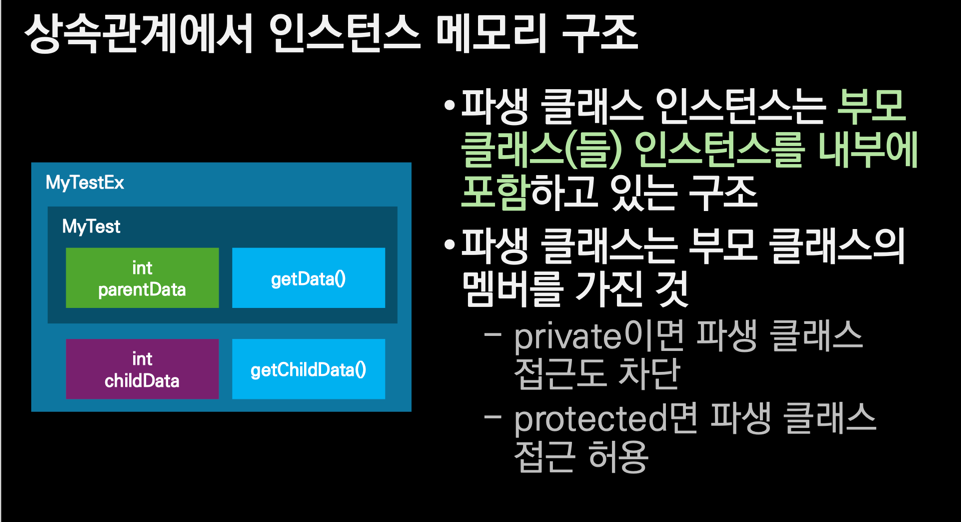

## 정적 멤버

- 클래스 인스턴스가 없어도 도긻적으로 존재 가능한 필드, 메서드
- 일반 메서드와 달리 인스턴스 선언없이 호출 가능
- 메서드에서 `this`를 사용할 수 없다.
- 정적 필드는 `final`을 선언함으로써 심볼릭 상수로 활용하는 경우가 많다.

### 정적 필드와 인스턴스 메모리의 차이

정적 필드는 인스턴스 메모리와 독립적이며 메소드 코드는 인스턴스마다 다르지 않고 하나만 존재한다.  
정적 필드와 정적 메서드 모두 메서드 영역에 존재한다.

---

## 상속과 관계

객체단위 코드를 재사용하는 방법 중 하나로 상속을 사용한다. is-a, has-a 관계로 설명이 가능하다.  
부모/자식 클래스, 기본/파생 클래스로 구분할 수 있다. C++과는 다르게 다중 상속을 허용하지 않으며 Java의 모든 클래스는 `Object`의 파생형식이다.
자식 클래스 생성 시 기본 클래스도 함께 생성된다. 자식 클래스는 기본 클래스 메서드를 재정의할 수 있다.  
상속을 이용하면 추상 자료형(Abstract Data Type)을 구현할 수 있다.

### 상속 관계에서 인스턴스 메모리 구조

- 자식 클래스 인스턴스는 부모 클래스 인스턴스를 내부에 포함하고 있는 구조다.
- 이때 부모 클래스의 멤버가 `private`이면 자식 클래스에서 접근도 차단되며 `protected`라면 허용된다.

### 상속과 생성자 호출 스택

- 자식 클래스 생성자는 가장 먼저 호출되지만 가장 나중에 실행된다.
- 재귀 호출과 비슷하게 생성자 함수에 대한 호출 스택이 쌓여 올라가는 것이 특징이다.
- 자식 클래스에서 부모 클래스 필드를 정의하는 것은 적절하지 않다.
-  
