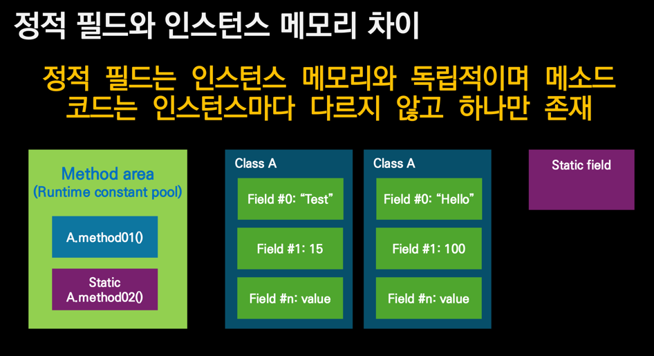

## 정적 멤버

- 클래스 인스턴스가 없어도 도긻적으로 존재 가능한 필드, 메서드
- 일반 메서드와 달리 인스턴스 선언없이 호출 가능
- 메서드에서 `this`를 사용할 수 없다.
- 정적 필드는 `final`을 선언함으로써 심볼릭 상수로 활용하는 경우가 많다.

### 정적 필드와 인스턴스 메모리의 차이

정적 필드는 인스턴스 메모리와 독립적이며 메소드 코드는 인스턴스마다 다르지 않고 하나만 존재한다.  
정적 필드와 정적 메서드 모두 메서드 영역에 존재한다.

### 