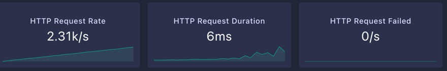
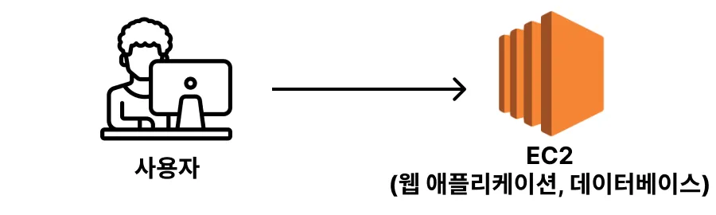
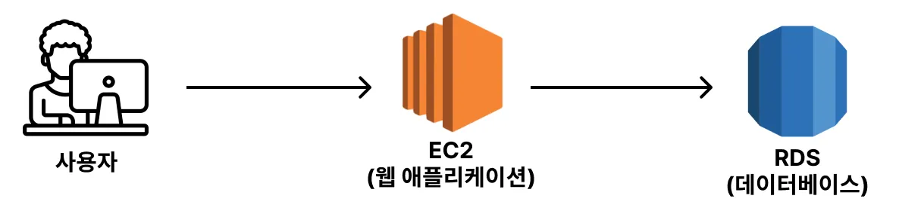
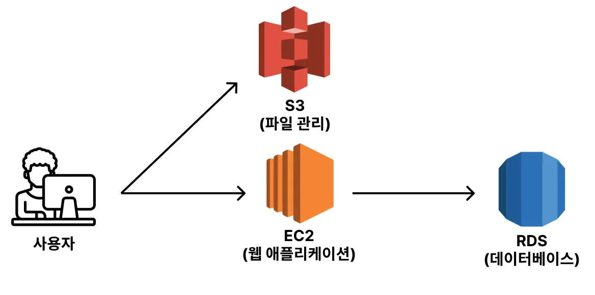
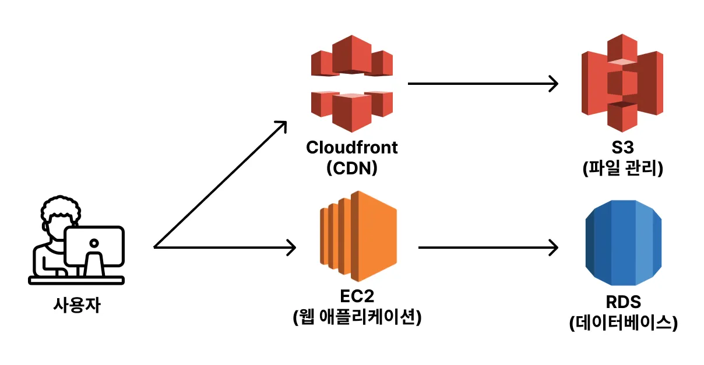
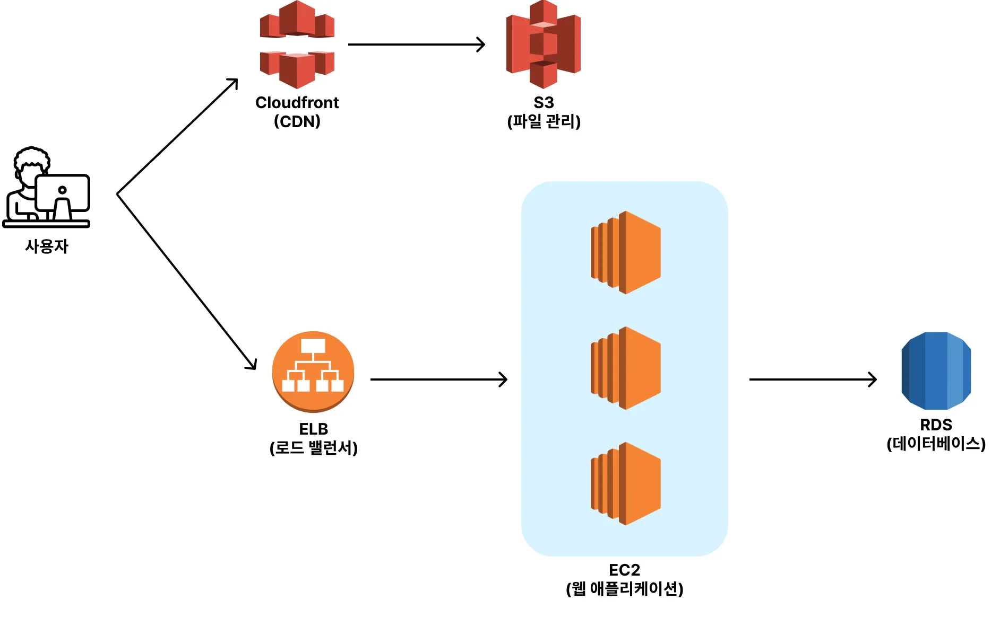

## 처리량과 지연 시간

### 처리량(Throughput)이란?

부하 테스트에서 서비스가 1초당 처리할 수 있는 트래픽 양을 보고 Throughput이라고 부른다. 단위는 TPS(Transaction Per Second)이다.  
TPS는 1초당 처리한 트랜잭션의 수를 의미한다. 만약 내가 만든 서비스가 1초에 최대 100개의 API 요청을 처리할 수 있다면, 이 서비스의  
처리량은 100TPS이다.

### 지연 시간(Latency)이란?

부하 테스트에서의 Latency는 요청에 대한 응답 시간을 의미한다. 만약 내가 만든 서비스에 부하 테스트를 했을 때 평균 응답  
시간이 2.5초일 경우, 평균 Latency가 2.5초라고 얘기한다. 조금 더 쉽게 해석하자면 하나의 API 요청을 보냈을 때 응답받기까지의  
시간이 2.5초 정도 걸린다는 뜻이다.

---

## K6 대시보드에서 살펴봐야할 것



- HTTP Request Rate : Throughput을 의미한다. 1초당 처리한 요청의 수를 나타낸다. 더이상 증가하지 않으면 그것이 최대 TPS다.
- HTTP Request Duration : Latency를 의미한다. 요청에 대한 응답 시간을 나타낸다.
- HTTP Request Failed : 요청 자체가 실패한 것.

---

## 병목 지점 진단하기

### 병목 지점이란

부하 테스트를 진행하다보면 병목 지점이라는 말을 자주 쓴다. 병목 지점이란, 전체 시스템에서 특정 서버 자원이 한계에 도달해  
전체 성능이 저하되는 구간을 말한다. 이때 성능 저하는 지연 시간의 증가와 처리량의 감소로 나타나게 된다. 결국 성능 저하를  
해결하기 위해서는 병목 지점을 찾아내고 해결해야 한다. 왜냐하면 결국 병목 지점에서 성능이 결정되기 때문이다. 아무리 Web에서  
WAS까지 가는 처리량이 1000이라 한들 WAS-DB에서 처리하는 양이 300이면 결국 시스템의 전체 처리량은 300이다.

### 부하 테스트의 흐름

1. 부하 테스트의 목표를 설정한다. 목표 처리량과 목표 레이턴시를 지정해야 한다.
2. 현재 시스템이 어느 정도 트래픽까지 견딜 수 있는 지 부하 테스트를 진행한다.
3. 병목 지점 파악 후 성능을 개선한다.
4. 개선한 시스템이 어느 정도 트래픽까지 견딜 수 있는 지 부하 테스트를 진행한다.
5. 목표치를 달성할 때까지 3, 4를 반복한다.

### 부하 테스트 시 주의해야할 점

- 적절한 부하 테스트 시간 설정
    - 부하 테스트 시간을 너무 짧게 설정하면 시스템이 견딜 수 있는 트래픽을 파악하기 어렵다.
    - 부하 테스트 시간을 너무 길게 설정하면 시스템의 상태가 변화하면서 결과가 달라질 수 있다.
- 프로덕션 환경과 비슷한 데이터 셋팅
    - 데이터베이스는 데이터가 어떻게 저장되어 있는 지와 얼마나 많은 양이 저장되어 있는 지에 따라서 성능 차이가 많이 난다.
    - 따라서 실제 프로덕션 환경과 비슷하게 데이터를 구성해두고 부하 테스트를 해야 보다 정확한 결과 값을 얻는다.
    - 현업에서는 주로 프로덕션 환경에 저장되어 있는 데이터의 양만큼 셋팅을 해두고 부하 테스트를 한다.

### K6 사용법

1. k6 설치
2. k6 스크립트 작성
3. k6 실행

```shell
 K6_WEB_DASHBOARD=true k6 run script.js # 대시보드를 보면서 실행
 ```

4. k6 대시보드 확인 `http://{k6가 실행되고 있는 EC2 IP 주소}:5665`으로 접속하기

### 부하 테스트, 성능 테스트에서 가장 중요한 지표는 CPU와 메모리, 디스크다.

DB는 CPU, 메모리, 디스크를 사용하는데 디스크로부터 데이터를 조회해서 메모리에 올린다.  
메모리에서 연산, 필터링, 집계 등의 작업을 CPU가 처리한다. DB의 특성상 많은 양의 데이터를 가지고 작업을 하는 경우가 많다.  
따라서 CPU와 메모리를 둘다 많이 사용하는 편이다.

백엔드 서버는 파일을 읽어오거나 파일을 생성하는 로직이 없다면 디스크는 거의 사용할 일이 없다. 파일 업로드나 파일 조회도  
S3와 같은 서비스를 활용해서 별도로 분리하는 추세다. DB로부터 불러오는 데이터의 양이 크지 않을 경우 메모리를 사용할 일이 없다.  
많은 요청에 대해 로직을 처리해야 하기 때문에 CPU를 많이 사용하는 편이다. 복잡한 연산 작업(인코딩, 디코딩, 암호화)는 CPU를 많이 사용한다.

로드 밸런서는 요청이 들어오면 적절하게 서버들에게 골고루 트래픽을 분배해주는 역할을 한다. 임시로 저장해야 하는 데이터가  
많은게 아니기 때문에 메모리를 사용할 일이 없다. 많은 요청을 분배해주는 로직을 처리하기 때문에 CPU를 많이 사용한다.

캐시는 특성상 빠르게 데이터를 조회해야 하기 때문에 메모리를 제일 많이 사용한다. CPU는 그에 반해 덜 사용된다.

### 병목 지점을 해결하는 간단한 예시

- 생성 API가 너무 오래걸린다.
    - 요청을 처리할 스레드 수를 늘려볼까?(잘못 조절하면 성능이 나빠질 수도 있다.)
    - 커넥션 풀이나 스레드 풀 숫자를 늘리기 전에 먼저 줄여서 확인해보자
    - 서버 사이즈를 키워볼까?
    - 응답과 생성을 분리해보자.

## 가용성, 시스템 이중화

### 가용성이란?

가용성은 시스템이 서비스를 정상적으로 ㅔㅈ공할 수 있는 가능성을 의미한다. 서비스에 장애가 발생할 가능성이 극히 작은 시스템을  
가용성이 높은 시스템이라고 말할 수 있다. 반대로 서비스가 다운되는 시간이 긴 시스템을 가용성이 낮은 시스템이라고 한다.

가용성이 높고 낮음은 서비스의 정상 가동률로 표시된다. 가용성이 99.99%라는 경우 99.99% 시간을 정상적으로 이용 가능한 시스템을  
말한다. 이를 바꿔 말하면 1년에 53분 정도는 서비스가 다운된다고 말할 수 있다.

높은 가용성을 가진 시스템을 설계하려면 여러 가지 방법이 있지만 가장 유효한 방법 중 하나가 시스템 이중화다.

### 시스템 이중화란?

시스템 이중화라는 것은 시스템의 일부분을 사용할 수 없게 되어도 다른 시스템을 이용하여 서비스를 계속 이용할 수 있게  
만드는 것을 의미한다. 예를 들어, 도시를 연결하는 도로가 하나가 아닌 두 개가 있다면 둘 중 하나의 도로에서 사고가 발생하더라도  
다른 도로를 이용하여 수송할 수 있다. 또한 두 개의 도로가 존재함으로써 도로 공사 중에도 정상적으로 수송을 할 수 있다.

---

## 트래픽 증가에 따른 시스템 설계 및 확장 방법

### 가장 간단한 형태


EC2 서버 한 대에 프론트엔드, 백엔드, 데이터베이스에 관련된 프로그램을 다 실행시키는 형태의 구성이다. 이 형태의 장점은  
하나의 서버에서 모든 리소스를 관리하기 때문에 관리 및 조작하기가 심플하다. 또한 다양한 리소스를 쓰지 않기 때문에 비용이  
적게 나오는 편이다. 하지만 이런 구성으로 실제 서비스를 운영하다보면 데이터베이스가 생각보다 많은 컴퓨팅 자원을  
사용한다. 데이터베이스로 인해 웹 애플리케이션의 성능에 악영향을 줄 수 있기 때문에 별도의 서버를 분리하는 형식을 많이  
가져간다.

### 데이터베이스 분리



웹 서버와 데이터베이스를 분리한 인프라 구성이다. 이 인프라 구성에서 트래픽이 많아지면 정적 파일을 제공하는 부분에서  
문제가 될 가능성이 크다, 일반적으로 정적 파일은 용량이 크기 때문에 컴퓨팅 자원을 많이 소모해서 서버에 과부하가 걸릴  
가능성이 크다.

### 정적 파일 서버 분리



S3를 활용해 정적 파일만을 제공하는 별도의 서버를 구축했다. 하지만 정적 파일은 용량이 큰 경우가 많기 때문에, 정적 파일을  
제공받는 곳이랑 거리가 멀면 멀수록 응답 속도가 오래 걸릴 수 밖에 없다. 이를 해결하기 위해 캐싱의 원리가 적용된 CDN을  
활용해서 정적 파일 전송 속도를 향상시킨다.

### CDN 서버 활용



이 구성에서 사용자 요청이 더 많아져서 EC2 인스턴스 한 대로 모든 요청을처리할 수 없는 상황이 왔다고 가정하자. 이런 경우  
에는 EC2를 확장해야 한다. 확장 방식에는 수직적 확장과 수평적 확장이 있다. 보통 시스템 이중화의 장점 때문에 EC2를 확장할  
때는 수평적 확장의 방식을 많이 활용한다.

### 수평적 확장



시스템 이중화를 하면서 로드 밸런서를 도입하고 EC2를 여러 대로 늘렸다. 그리고 골고루 트래픽을 분산할 수 있게 되었다.  
하지만 늘어난 웹 애플리케이션 서버에 따라 많은 수의 요청이 DB에 몰리게 된다.

DB에서 병목 현상이 발생하면 DB 자체적으로 성능을 개선할 수 있는 부분은 없는 지를 먼저 고려한다. DB 자체적으로 성능을  
개선하는 방법에는 인덱스 활용, 역정규화, SQL문 튜닝 등이 있다. 이 방식으로 최대한 개선을 했는데도 DB에 병목이 발생할 수  
있다. 그러면 수평적 확장의 방식을 고려해봐야 한다.

하지만 DB에 수평적 확장의 방식을 적용시키는 건 어려운 점이 많다. 왜냐하면 기존에 저장되어 있는 데이터를 수평적 확장한  
모든 DB에 복사해서 관리해야 한다. 데이터의 변경이 일어날 때마다 여러 대의 DB가 동기화 작업을 해야 한다. 동기화 작업은  
DB 성능 저하를 유발하기 때문에 오히려 장점보다 단점이 더 큰 확장 방식이라고 판단했다.  
이 때문에 DB는 수평적 확장보다는 수직적 확장의 방식으로 성능을 개선한다.

만약 DB를 최대한 수직적 확장을 했음에도 불구하고 추가적인 성능 개선이 필요하다면 읽기 전용 데이터베이스 도입을 고려한다.