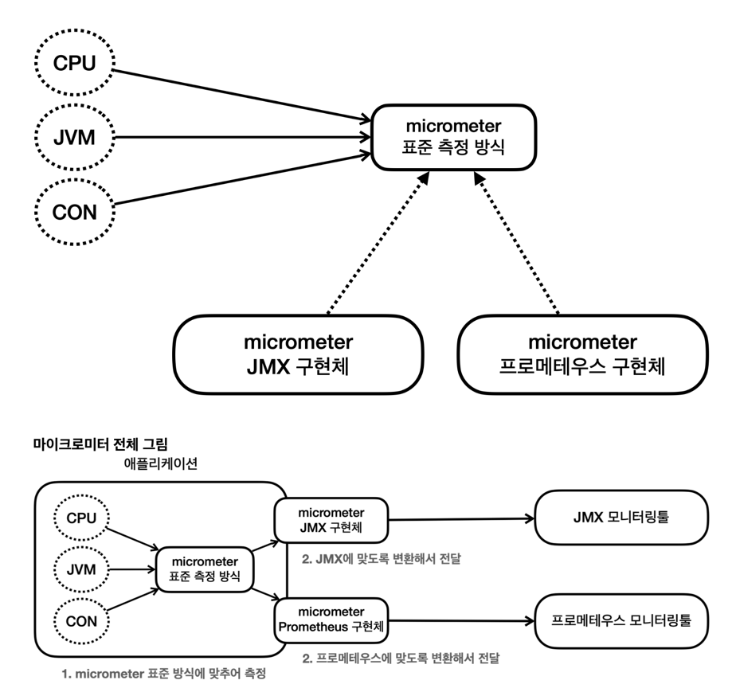

## 웹 서버와 서블릿 컨테이너

### 외장 서버와 내장 서버

- 과거에 자바로 웹 애플리케이션 개발 시에는 서버에 톰캣 같은 WAS를 먼저 설치했다. 그리고 WAS에서 동작하도록 서블릿 스펙에 맞추어 코드를 작성하고 WAR 파일을 만들어서 WAS에 배포했다.
- 최근 방식에서는 스프링 부트가 내장 톰캣을 포함하고 있다. 애플리케이션 코드 안에 톰캣 같은 WAS가 라이브러리로 내장되어 있다.
- **개발자는 코드를 작성하고 JAR로 빌드한 다음에 해당 JAR를 원하는 위치에서 실행하기만 하면 된다.**

### 스프링 부트 프로젝트는 대형 서비스에 부적합할까?

- 그렇지 않다.
- 내장 톰캣은 외장 톰캣과 다르게 Virtual Host 기능을 제공하지 않는다. Virtual Host는 하나의 서버에서 여러 서비스를 제공할 수 있게 해준다.
- Virtual Host의 기능은 Web Server의 역할이기 때문에 WAS에서 해당 기능을 제공하는 것은 WAS의 역할과는 거리가 멀다.
- 과거에는 하나의 고사양 서버에 여러 애플리케이션을 운영하는 것이 효율적이었으나 현재는 하나의 애플리케이션에 하나의 서비스만 구성하고 운영하는것이 효율적이다.
- 하나의 VM이나 Docker로 하나의 서비스만 구성하고 여러 개로 나누어서 서비스하는 것이 대세이다.

### WAR 배포 방식의 단점

- 톰캣 같은 웹 애플리케이션 서버를 별도로 설치해야 한다. 애플리케이션 코드를 WAR로 빌드해야 한다. 빌드한 WAR 파일을 WAS에 배포해야 한다.
- 이렇게 하나의 애플리케이션을 구동하려면 웹 애플리케이션 서버를 별도로 설치해야 하는 구조이다.

---

## 액츄에이터

### 프로덕션 준비 기능

- 서비스를 실제 운영 단계에 올리게 되면 개발자들이 해야하는 또 다른 중요한 업무는 모니터링이다.
- 운영 환경에서 서비스할 때 필요한 이런 기능들을 프로덕션 준비 기능이라 한다. 쉽게 이야기해서 프로덕션을 운영에 배포할 때 준비해야 하는 비 기능적 요소들을 뜻한다.
- 좀 더 구체적으로 설명하자면, 애플리케이션이 현재 살아있는지, 로그 정보는 정상 설정 되었는지, 커넥션 풀은 얼마나 사용되고 있는지 등을 확인할 수 있어야 한다.

### 액츄에이터 엔드포인트

- 액츄에이터가 제공하는 수 많은 기능 하나하나를 엔드포인트라 한다. `health`는 헬스 정보를, `beans`는 스프링 컨테이너에 등록된 빈을 보여준다.
- 엔드포인트는 대부분 기본으로 활성화 되어 있다.(shutdown은 제외) 따라서 어떤 엔트포인트를 노출할지 선택하면 된다. 참고로 HTTP와 JMX를 선택할 수 있는데 JMX는 사용하지 않는다.

### 다양한 엔드포인트

- `beans` : 스프링 컨테이너에 등록된 스프링 빈
- `env` : 스프링 애플리케이션의 환경 설정 정보
- `health` : 애플리케이션의 상태 정보
- `httpexchanges` : HTTP 호출 응답 정보를 보여준다. `HttpExchangeRepository`를 구현한 빈을 별도로 등록해야 한다.
- `loggers` : 로깅 관련 설정 정보
- `metrics` : 애플리케이션의 상태 정보를 보여준다. `MeterRegistry`를 구현한 빈을 별도로 등록해야 한다.
- `mappings` : URL 매핑 정보
- `shutdown` : 애플리케이션을 종료한다. `@Bean`으로 등록한 `GracefulShutdown` 빈을 사용한다.
- `threaddump` : 스레드 덤프 정보
- `heapdump` : 힙 덤프 정보
- `cache` : 캐시 관련 정보

### 액츄에이터로 실시간 로그 정보 변경하기

개발 서버는 보통 `DEBUG` 로그를 사용하지만 운영 서버는 요청이 많기 때문에 `DEBUG`까지 출력하게 되면 성능이나 디스크에 영향을 준다.  
그런데 서비스 운영 중에 문제가 있어서 `DEBUG`나 `TRACE` 로그를 남겨서 확인해야 한다면 어떻게 해야할까? 일반적으로는 서버를 다시 시작한다.  
`loggers` 엔드포인트를 사용하면 애플리케이션을 다시 시작하지 않고, 실시간으로 로그 레벨을 변경할 수 있다. 아래는 그 예시다.

`POST` http://localhost:8080/actuator/loggers/hello.controller

```json
{
  "configuredLevel": "TRACE"
}
```

### 액츄에이터와 보안

액츄에이터가 제공하는 기능들은 우리 애플리케이션의 내부 정보를 많이 노출한다. 그래서 외부 인터넷 망이 공개된 곳에 액츄에이터의  
엔드포인트를 공개하는 것은 보안상 위험하다. 액츄에이터의 엔드포인트들은 외부 인터네셍서 접근이 불가능하게 막고  
내부에서만 접근 가능한 내부망을 사용하는 것이 안전하다.

---

## 마이크로미터



- 마이크로미터는 메트릭 퍼사드라고 부른다. 애플리케이션의 메트릭을 마이크로미터 표준으로 제공해준다.
- 개발자는 마이크로미터가 정한 표준 방법으로 메트릭을 전달하면 된다. 그리고 사용하는 모니터링 툴에 맞는 구현체를 선택한다.
- 이후에 모니터링 툴이 변경되어도 해당 구현체만 변경하면 된다.
- 스프링 부트 액츄에이터는 마이크로미터가 제공하는 지표 수집을 자동 구성을 통해 자동으로 등록해준다.

### 마이크로미터와 액츄에이터가 기본으로 제공하는 다양한 메트릭

- JVM 메트릭 : JVM 메모리 사용량, GC 정보 등
- 시스템 메트릭 : CPU 사용량, 메모리 사용량 등
- 애플리케이션 시작 메트릭
- 스프링 MVC 메트릭
- 톰캣 메트릭
- 데이터 소스 메트릭
- 로그 메트릭 등등
- 사용자 정의 메트릭

### JVM 메트릭

- JVM 메트릭은 `jvm.`으로 시작한다.
- 메모리 및 버퍼 풀 세부 정보
- 가비지 수집 관련 통계
- 스레드 활용
- 로드 및 언로드된 클래스 수
- JVM 버전 정보
- JIT 컴파일 시간

### 톰캣 메트릭

- 톰캣 메트릭은 `tomcat.`으로 시작한다.
- 톰캣 메트릭을 모두 사용하려면 별도의 옵션을 켜야한다.
- server.tomcat.mbeanregistry.enabled=true

### 메트릭을 등록하는 법

- `MeterRegistry`를 구현한 빈을 등록하면 된다. 마이크로미터 기능을 제공하는 컴포넌트로서 카운터, 게이지 등록이 가능하다.

### `Counter`

- Counter는 단조롭게 증가하는 단일 누적 측정항목을 의미한다. 값을 증가하거나 0으로 초기화 시키는 것이 가능하다.
- 뺄셈도 가능하지만 목적에 맞지 않으므로 지양하자.

### 'Timer'

- Timer는 주어진 코드 블록의 실행 시간을 측정하는 데 사용된다. 주어진 코드 블록의 실행 시간을 측정하고, 해당 시간을 분포로 기록한다.
- `seconds_count` : 타이머가 호출된 횟수
- `seconds_sum` : 실행 시간의 합
- `seconds_max` : 최대 실행 시간(가장 오래 걸린 시간)
- `seconds_sum` / `seconds_count` = 평균 실행시간

### `Gauge`

- 게이지는 임의로 오르내릴 수 있는 단일 숫자 값을 나타내는 메트릭
- 값의 현재 상태를 보는데 사용한다. 값이 증가하거나 감소할 수 있다. CPU 사용량이나 메모리 사용량을 측정할 때 사용한다.
- 카운터와 게이지를 구분할 때는 값이 감소할 수 있는가를 고민해보면 도움이 된다.


